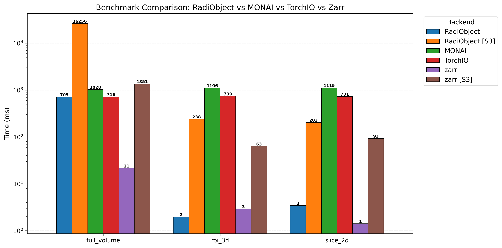

# RadiObject

[](https://pypi.org/project/radiobject/)
[](https://www.python.org/downloads/)
[](https://opensource.org/licenses/MIT)
[](https://srdsam.github.io/RadiObject/)

**What?** A TileDB-backed data structure for radiology data at scale.

**Why?** NIfTI/DICOM must be read from local disk and don't support partial reads.
TileDB enables cloud-native storage (S3), efficient partial reads, and
hierarchical organization of large datasets.


## First Principles

- Contextualised data: *Data is always read/written alongside annotations and context, aligned on shared and labelled indexes. Minimize manual joins.*
- Interoperability: *Software should complement the ecosystem of tooling, not compete.*

*See full [thoughts here](https://souzy.up.railway.app/thoughts/radiology-object).*


## Installation

```bash
pip install radiobject
```

## Quick Start

```python
import numpy as np
from radiobject import (
    RadiObject, VolumeCollection, Volume,
    configure, WriteConfig, ReadConfig, TileConfig,
    SliceOrientation, CompressionConfig, Compressor,
)

# Configure how volumes are written (important for performance!)
configure(write=WriteConfig(
    tile=TileConfig(orientation=SliceOrientation.AXIAL),
    compression=CompressionConfig(algorithm=Compressor.ZSTD, level=3),
))

# Create RadiObject (read NIfTI/DICOM; write TileDB)
radi = RadiObject.from_niftis(
    uri="./my-dataset",
    images={
        "CT": "./imagesTr/*.nii.gz",  # Glob pattern
        "seg": "./labelsTr",          # Directory path
    },
    validate_alignment=True,          # Ensure matching subjects across collections
    obs_meta=metadata_df,             # Optional subject-level metadata
)

# Access data (pandas-like)
vol: Volume = radi.CT.iloc[0]          # First CT volume
data: np.ndarray = vol[100:200, :, :]  # Or vol.axial(155) works for partial read

# Transform data (polars-like)
ct_resampled: VolumeCollection = radi.CT.map(resample).write(name="CT_resampled")
radi.add_collection(name="CT_resampled", vc=ct_resampled)

# Filter data (returns views)
subset: RadiObject = radi.filter("age > 40")   # Query expression
subset = radi.head(10)                         # First 10 subjects
subset.write("./subset_with_resampled_CT")
```

Works with local paths or S3 URIs (`s3://bucket/dataset`).

## How It Works

NIfTI requires decompressing entire volumes; TileDB reads only the tiles needed.
This enables **200-660x faster** partial reads. [See benchmarks →](docs/reference/benchmarks.md)



*N.B. Missing comparison with [Zarr](https://github.com/zarr-developers/zarr-python)* 

## Sample Data

Download sample datasets for tutorials and testing:

```bash
# Install download dependencies
pip install radiobject[download]

# Download BraTS brain tumor data (for tutorials 00-04)
python scripts/download_dataset.py msd-brain-tumour

# List all available datasets
python scripts/download_dataset.py --list
```

## Documentation

| | |
|---|---|
| **[Tutorials](docs/tutorials/index.md)** | Interactive notebooks: ingestion, querying, volumes, ML |
| **[How-to Guides](docs/how-to/index.md)** | Task-oriented recipes for ingestion, access, ML, cloud |
| **[Reference](docs/reference/index.md)** | API docs, configuration, benchmarks, lexicon |
| **[Explanation](docs/explanation/architecture.md)** | Architecture, performance analysis |

## Development

```bash
uv sync --all-extras
uv run pytest test/ --ignore=test/ml -v
```

## License

MIT
