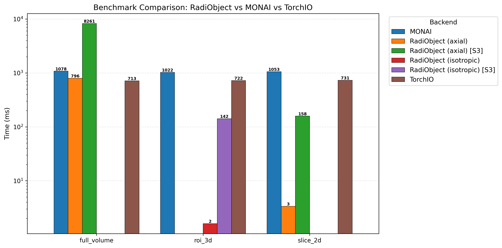

# RadiObject

[](https://pypi.org/project/radiobject/)
[](https://www.python.org/downloads/)
[](https://opensource.org/licenses/MIT)

A TileDB-backed data structure for radiology data at scale. Cloud-native, partial-read-optimized, pandas-like API.

## Install

```bash
pip install radiobject
```

## Quick Start

```python
from radiobject import RadiObject

# Create from NIfTI files
radi = RadiObject.from_niftis(
    uri="./my-dataset",
    images={"CT": "./imagesTr/*.nii.gz", "seg": "./labelsTr"},
    obs_meta=metadata_df,
)

# Access data (pandas-like)
vol = radi.CT.iloc[0]             # First CT volume
data = vol[100:200, :, :]         # Partial read — only loads needed tiles
slc = vol.axial(64)               # Single axial slice

# Filter and export
subset = radi.filter("age > 40")  # Query expression on obs_meta
subset.head(10).write("./subset")
```

Works with local paths or S3 URIs (`s3://bucket/dataset`).

## Documentation

| | | |
|---|---|---|
| **[Tutorials](tutorials/index.md)** | Interactive notebooks | *Learn RadiObject from scratch* |
| **[How-to Guides](how-to/index.md)** | Task-oriented recipes | *Ingest, access, train, deploy* |
| **[Reference](reference/index.md)** | API docs, config, benchmarks | *Look up specifics* |
| **[Explanation](explanation/architecture.md)** | Architecture and performance | *Understand design decisions* |


