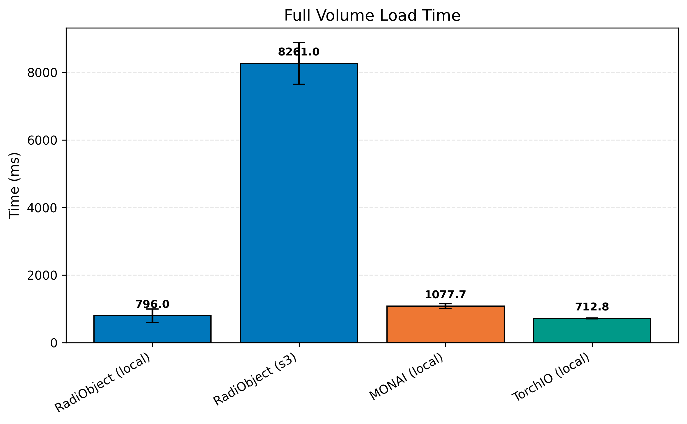
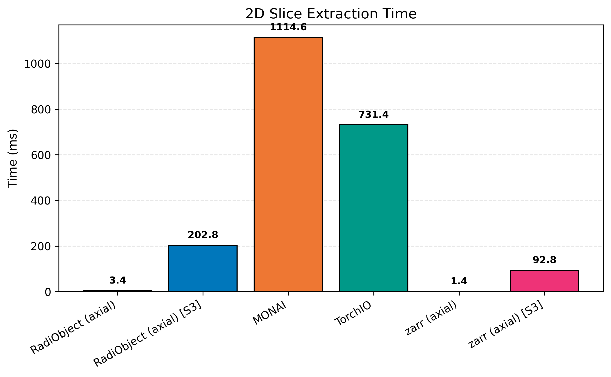
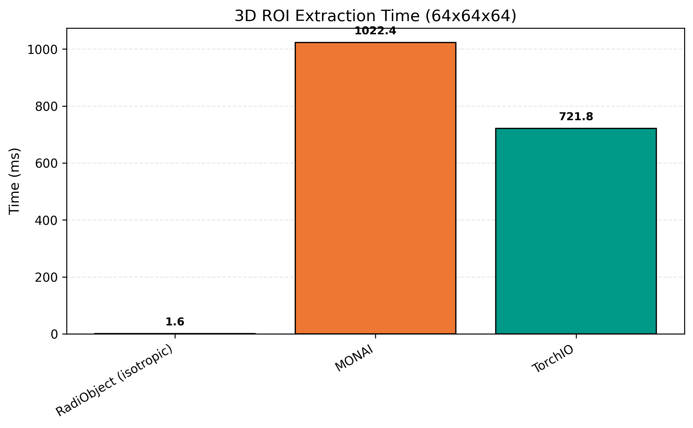
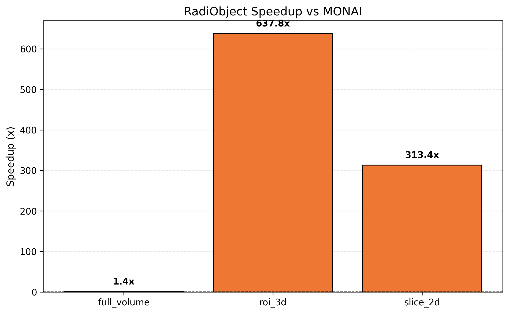
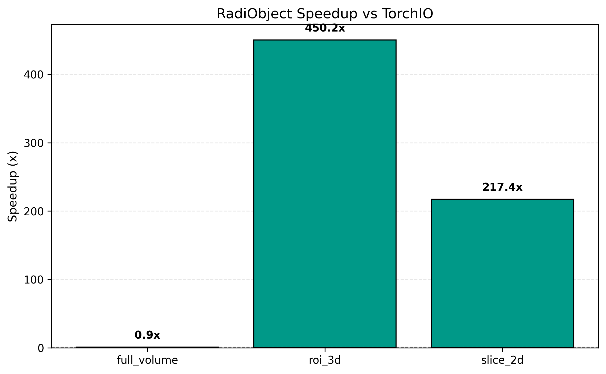
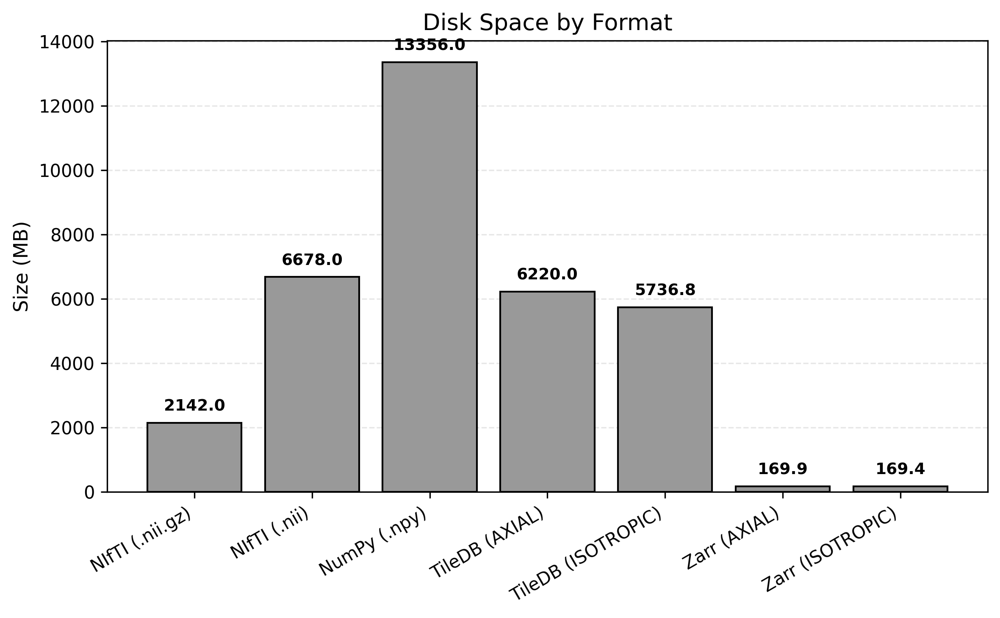
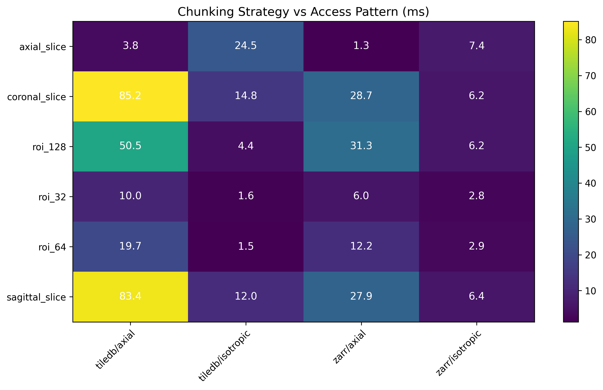
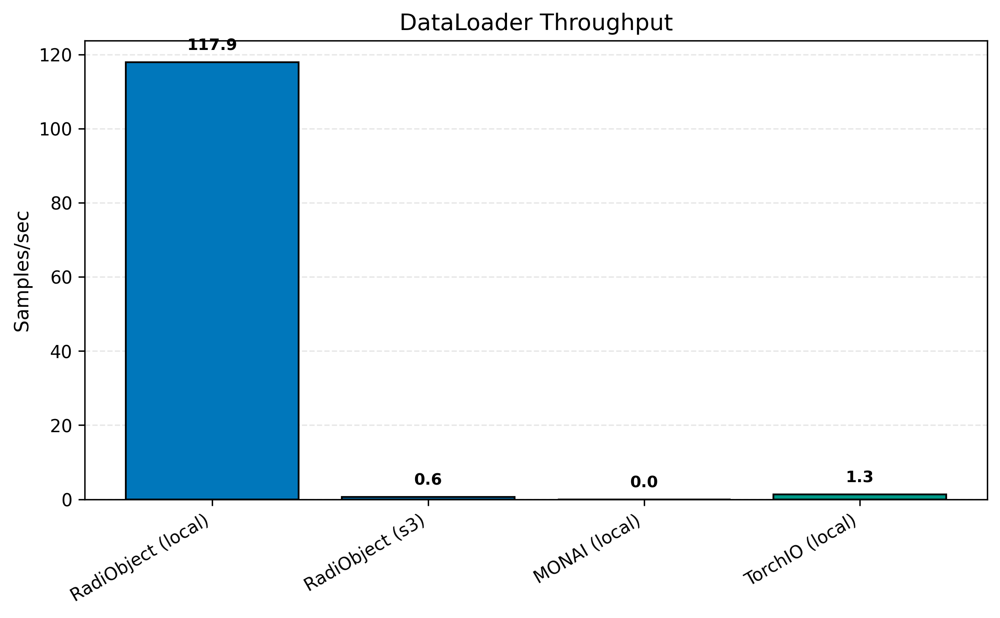

# Benchmarks

> RadiObject enables **200-660x faster** partial reads and native S3 access.


**Configuration:** batch_size=4, patch_size=64^3, n_runs=10, 20 MSD subjects, local SSD + S3 (us-east-2)

---

## Full Volume Load



| framework   | scenario | tiling    | time_ms | cpu_pct | heap_mb |
|-------------|----------|-----------|---------|---------|---------|
| RadiObject  | local    | isotropic | 107     | 66      | 304     |
| nibabel     | local    | -         | 32      | 34      | 608     |
| numpy       | local    | -         | 40      | 43      | 608     |
| nibabel     | local    | gzip      | 416     | 15      | 912     |
| RadiObject  | local    | axial     | 796     | 67      | 304     |
| TorchIO     | local    | -         | 713     | 21      | 304     |
| MONAI       | local    | -         | 1078    | 10      | 608     |
| RadiObject  | s3       | axial     | 8261    | 18      | 304     |

RadiObject isotropic (107ms) is competitive with raw nibabel (32ms) while enabling random access.

See [Performance: Why Full Volume is Slower](../explanation/performance.md#why-full-volume-is-slower-than-raw-nifti) for interpretation.

---

## 2D Slice Extraction



| method              | scenario | tiling    | time_ms   |
|---------------------|----------|-----------|-----------|
| RadiObject          | local    | axial     | **3.4**   |
| RadiObject          | local    | isotropic | 24        |
| RadiObject          | s3       | axial     | 158       |
| MONAI               | local    | -         | 1053      |
| TorchIO             | local    | -         | 731       |

**310x faster** than MONAI, **215x faster** than TorchIO for axial slices.

See [Performance: Why Axial Tiling Gives 200-600x Speedup](../explanation/performance.md#why-axial-tiling-gives-200-600x-speedup-for-slices) for interpretation.

---

## 3D ROI Extraction



| method              | scenario | tiling    | time_ms   |
|---------------------|----------|-----------|-----------|
| RadiObject          | local    | isotropic | **1.6**   |
| RadiObject          | local    | axial     | 20        |
| RadiObject          | s3       | isotropic | 142       |
| MONAI               | local    | -         | 1022      |
| TorchIO             | local    | -         | 722       |

**639x faster** than MONAI, **451x faster** than TorchIO for isotropic 64^3 ROIs.

See [Performance: Why Isotropic is Best for 3D Patches](../explanation/performance.md#why-isotropic-is-best-for-3d-patches) for interpretation.

---

## Framework Speedups





| operation | monai_ms | torchio_ms | radiobject_ms | vs_monai | vs_torchio |
|-----------|----------|------------|---------------|----------|------------|
| slice_2d  | 1053     | 731        | 3.4           | 310x     | 215x       |
| roi_3d    | 1022     | 722        | 1.6           | 639x     | 451x       |

MONAI and TorchIO must load the full volume for any access pattern. RadiObject reads only the tiles needed.

---

## S3 vs Local

| framework   | operation   | scenario | tiling    | time_ms   |
|-------------|-------------|----------|-----------|-----------|
| RadiObject  | full_volume | local    | axial     | 796       |
| RadiObject  | full_volume | s3       | axial     | 8261      |
| RadiObject  | slice_2d    | local    | axial     | 3.4       |
| RadiObject  | slice_2d    | s3       | axial     | 158       |
| RadiObject  | roi_3d      | local    | isotropic | 1.6       |
| RadiObject  | roi_3d      | s3       | isotropic | 142       |

Partial reads on S3 (142-158ms) are **52-58x faster** than full volume S3 reads (8261ms).

See [Performance: Why S3 is ~14x Slower](../explanation/performance.md#why-s3-is-14x-slower-for-full-volumes) for interpretation.

---

## Format and Storage Overhead



| format          | size_gb | compression | partial_read |
|-----------------|---------|-------------|--------------|
| NIfTI (.nii.gz) | 2.1     | 2.84x       | No           |
| NIfTI (.nii)    | 6.7     | 0.91x       | No           |
| NumPy (.npy)    | 13.4    | 0.46x       | No           |
| TileDB (axial)  | 6.2     | 0.98x       | Yes          |
| TileDB (iso)    | 5.7     | 1.06x       | Yes          |

TileDB uses ~3x more space than gzipped NIfTI, but enables partial reads that are 200-660x faster.

---

## Tiling Strategy Impact



| access_pattern | axial_ms | isotropic_ms | best_choice |
|----------------|----------|--------------|-------------|
| axial_slice    | **3.1**  | 24           | Axial       |
| coronal_slice  | 86       | **15**       | Isotropic   |
| sagittal_slice | 85       | **12**       | Isotropic   |
| roi_32         | 10       | **1.5**      | Isotropic   |
| roi_64         | 20       | **1.5**      | Isotropic   |
| roi_128        | 52       | **4.4**      | Isotropic   |

See [Performance: Tiling Strategy Guide](../explanation/performance.md#tiling-strategy-guide).

---

## Memory Efficiency

| operation        | radiobject_mb | nifti_load_mb |
|------------------|---------------|---------------|
| slice_extraction | **1**         | 300-900       |
| full_volume      | 304           | 300-600       |

Partial reads use minimal memory because only the requested tiles are loaded.

---

## ML Training Throughput



| framework   | ms_per_batch | samples_per_sec | notes                   |
|-------------|--------------|-----------------|-------------------------|
| RadiObject  | 34           | 118             | isotropic, local        |
| TorchIO     | 3086         | 1.3             | local, full volume load |
| RadiObject  | 6254         | 0.6             | isotropic, S3           |

RadiObject is **91x faster** than TorchIO for local patch-based training (batch_size=4, patch_size=64^3).

### Patch-Based I/O Reduction

| loading_mode | data_per_sample | 10k_subject_epoch_io |
|--------------|-----------------|----------------------|
| FULL_VOLUME  | 35.6 MB         | 356 GB               |
| PATCH (64^3) | 262 KB          | 2.6 GB               |
| PATCH (128^3)| 2.1 MB          | 21 GB                |

---

## Multi-Worker Scaling

| num_workers | time_3_volumes | time_per_volume |
|-------------|----------------|-----------------|
| 0           | 0.16s          | 0.05s           |
| 1           | 6.06s          | 2.02s           |
| 2           | 11.14s         | 3.71s           |

`num_workers=0` for <100 volumes, `num_workers=4-8` for >1000 volumes.

See [Performance: Why Multi-Worker DataLoaders Slow Down](../explanation/performance.md#why-multi-worker-dataloaders-slow-down-small-datasets) for interpretation.

---

## Cache Hit Rates

| access_pattern                | hit_rate |
|-------------------------------|----------|
| Sequential (shared context)   | 85-95%   |
| Random (shared context)       | 60-75%   |
| Repeated slices (same volume) | 90-99%   |
| Isolated contexts             | 0%       |

---

## Parallel Write Scaling

| workers | local_ssd_mb_s | s3_mb_s |
|---------|----------------|---------|
| 1       | ~140           | ~50     |
| 4       | ~410           | ~150    |
| 8       | ~650           | ~250    |
| 16      | ~800           | ~300    |

Throughput scales linearly on local SSD (~140 MB/s per worker).

---

## GIL Interaction

| operation            | gil_released | parallel_speedup          |
|----------------------|--------------|---------------------------|
| TileDB I/O           | Yes          | ~3-6x with 4 workers     |
| TileDB decompression | Yes          | ~3-4x with 4 workers     |
| NumPy array ops      | Partially    | ~1.5-2x                  |
| Pure Python          | No           | ~1x                       |

---

## RadiObject + MONAI/TorchIO

RadiObject is a **storage layer** that complements MONAI and TorchIO transforms:

```python
from radiobject.ml.compat import as_torchio_subject

subject = as_torchio_subject(radi.T1w.iloc[0], radi.seg.iloc[0])
augmented = my_torchio_transform(subject)
```

The benchmarks compare **I/O performance only**. Use RadiObject for data loading, then apply MONAI/TorchIO transforms.

---

## Running Benchmarks

```bash
eval $(aws configure export-credentials --profile souzy-s3 --format env)
python benchmarks/run_experiments.py --all
```

See `benchmarks/README.md` for details.
